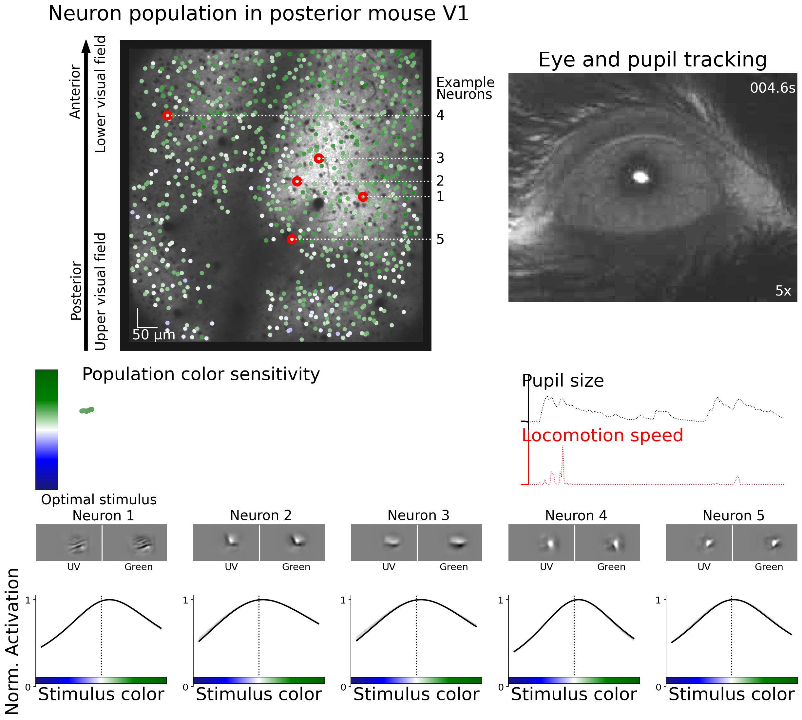

# nndichromacy

## Publication:
Code base for the publication:
[State-dependent pupil dilation rapidly shifts
visual feature selectivity](https://www.nature.com/articles/s41586-022-05270-3https://www.nature.com/articles/s41586-022-05270-3) [Nature, 2022]

A collaboration of the Neuronal Intelligence lab of Fabian Sinz, the Neural Circuits of Vision lab of Katrin Franke, and the lab of Andreas Tolias.

## Data
Visit this [repository](https://www.nature.com/articles/s41586-022-05270-3https://www.nature.com/articles/s41586-022-05270-3) for the all datasets used in this study.

## See also

See [Sensorium](https://github.com/sinzlab/sensorium) for demos and tutorials of the CNN model and the model fitting pipeeline